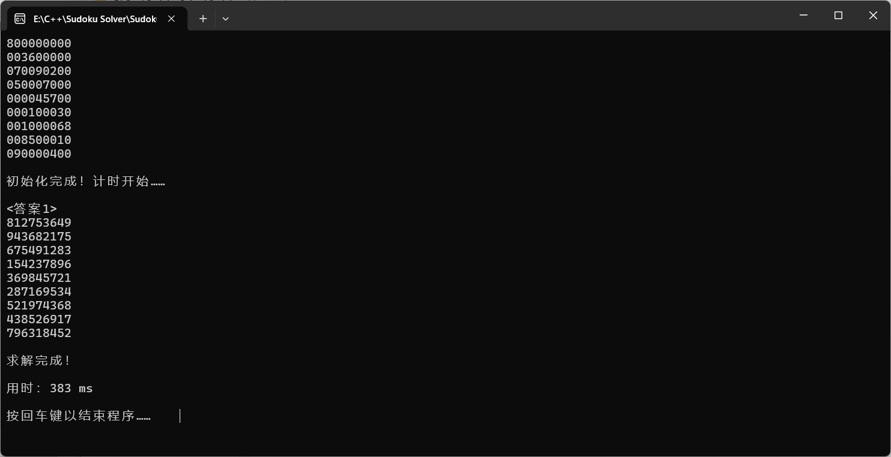
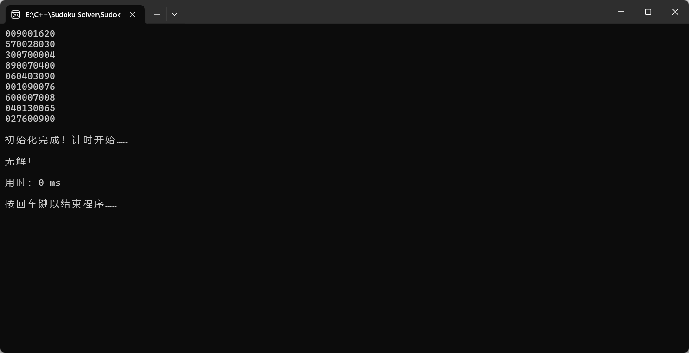
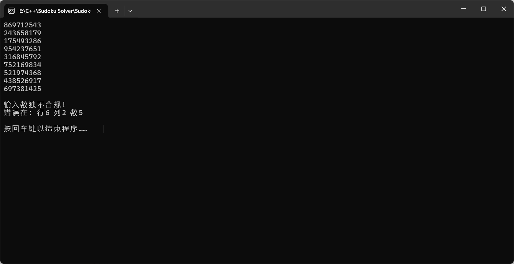

# Sudoku Solver
 求解给定数独的所有答案

## 算法
- 状态压缩
- 启发式排序
- 深度优先搜索（含剪枝）

虽然没有用舞蹈十字链算法，但效率几乎可以与其媲美！！！

（详见：[洛谷评测记录](https://www.luogu.com.cn/record/158037918)、[51nod评测记录](https://www.51nod.com/Challenge/ProblemSubmitDetail.html#judgeId=1714813)）

## 示例
- 世界上最难的数独

- 多解数独

- 无解数独

- 不合规数独

